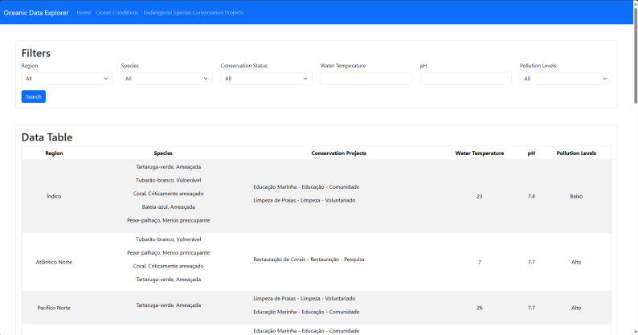
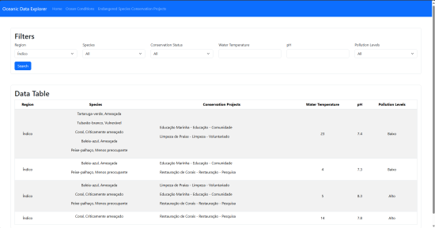
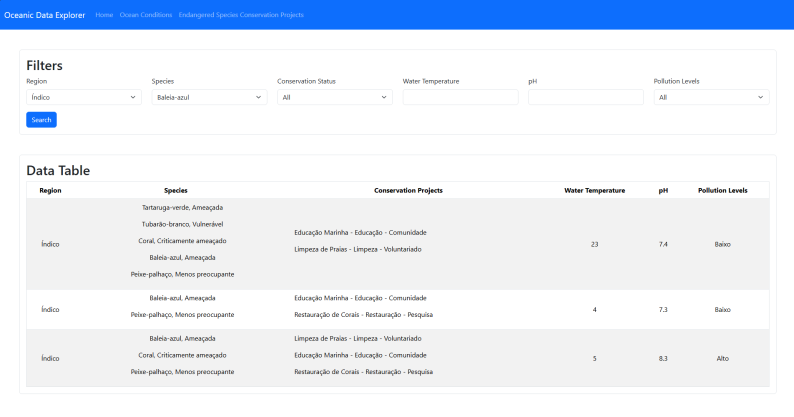
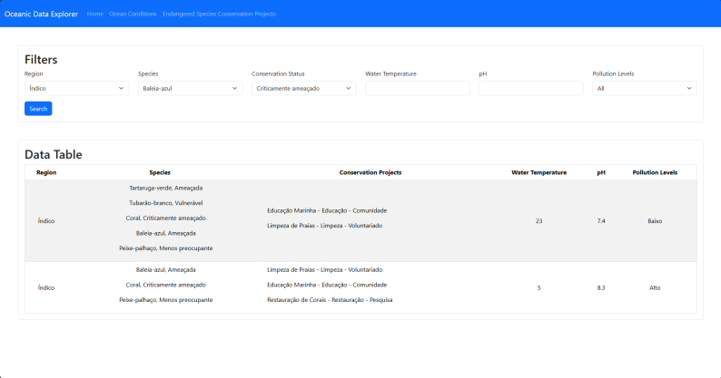
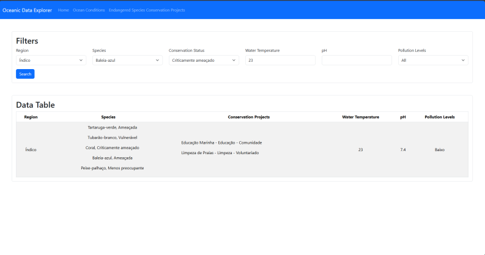
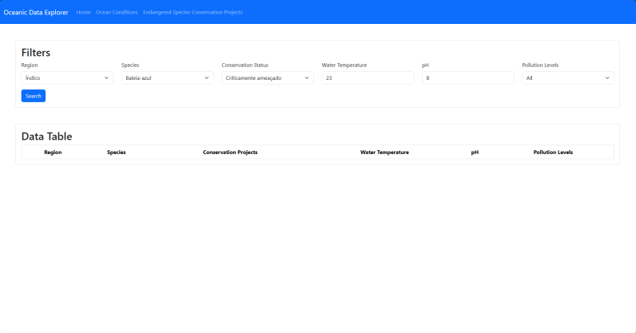
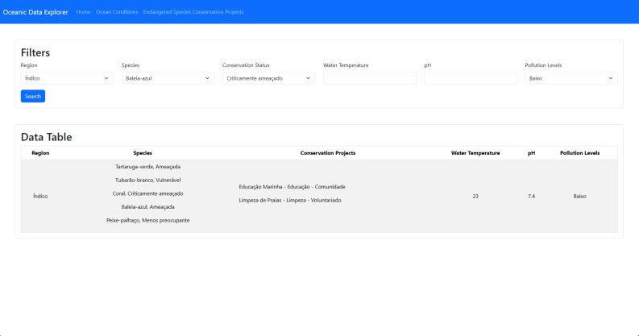

# Global Solution - Angular

## Integrantes

- Gabriel Vidoi Mendonça - RM: 94226
- Pedro Henrique Gonçalves Tura - RM: 93391
- Rafael Gualdieri Pinheiro - RM: 93036

## Rodando o projeto

Para rodar o projeto, basta acessar os arquivos pelo Visual Studio Code, abrir o terminal de comandos e executar a instrução `ng serve`. Após isso, é necessário seguir o link `http://localhost:4200` para abrir a página.

## Imagens

